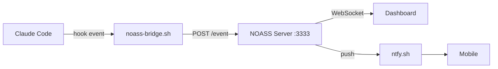

# NOASS

**Not Only Agent Screen Saver** -- 1-bit dithered agent monitoring for Claude Code.

Real-time dashboard that watches your Claude Code sessions, tracks context burn,
pushes alerts to your phone, and renders it all through a 1-bit dithered lens.

```
░▒▓█ Tauri 2 desktop app  ·  Hono + WebSocket server  ·  ntfy.sh push █▓▒░
```

---

## ░▒▓ Architecture



Claude Code hooks fire on every tool call, notification, stop, and sub-agent
lifecycle event. The bridge script POSTs raw hook JSON to the NOASS server.
The server derives agent state, tracks sessions, and broadcasts a `StateMessage`
over WebSocket to all connected dashboards. Transitions into `awaiting_input` or
`error` trigger a push notification via ntfy.sh.

---

## ░▒▓ Features

- **Multi-session monitoring** -- watch N agents simultaneously, each with status, context %, cost, model, cwd
- **Sub-agent tracking** -- see spawned agents appear and disappear under their parent session
- **Conversation log** -- last 50 user/assistant/notification entries per session
- **Push notifications** -- ntfy.sh alerts on permission prompts, errors, and idle agents (60s debounce)
- **Magic link auth** -- no passwords, no email service. Login link delivered via ntfy push
- **Session persistence** -- state cached to disk every 30s, survives restarts
- **Metrics bridge** -- statusline hook pipes context %, cost, model, lines changed into each session
- **Input queue** -- POST text to a session or broadcast to all, polled by agents
- **1-bit dithered UI** -- Tauri 2 desktop shell with canvas-rendered dashboard

---

## ░▒▓ Quick Start

### Server

```bash
cd server
pnpm install
pnpm dev
```

Server starts on `http://localhost:3333`. Set env vars for production:

```bash
PORT=3333 NTFY_TOPIC=your-topic NOASS_WEBHOOK_KEY=secret pnpm dev
```

### Hook Setup

Add to `~/.claude/settings.json`:

```json
{
  "hooks": {
    "PreToolUse": [{ "type": "command", "command": "curl -s -X POST http://localhost:3333/event -H 'Content-Type: application/json' -d \"$(cat)\"" }],
    "PostToolUse": [{ "type": "command", "command": "curl -s -X POST http://localhost:3333/event -H 'Content-Type: application/json' -d \"$(cat)\"" }],
    "PostToolUseFailure": [{ "type": "command", "command": "curl -s -X POST http://localhost:3333/event -H 'Content-Type: application/json' -d \"$(cat)\"" }],
    "Notification": [{ "type": "command", "command": "curl -s -X POST http://localhost:3333/event -H 'Content-Type: application/json' -d \"$(cat)\"" }],
    "Stop": [{ "type": "command", "command": "curl -s -X POST http://localhost:3333/event -H 'Content-Type: application/json' -d \"$(cat)\"" }],
    "SubagentStart": [{ "type": "command", "command": "curl -s -X POST http://localhost:3333/event -H 'Content-Type: application/json' -d \"$(cat)\"" }],
    "SubagentStop": [{ "type": "command", "command": "curl -s -X POST http://localhost:3333/event -H 'Content-Type: application/json' -d \"$(cat)\"" }]
  }
}
```

### Statusline Metrics (optional)

Pipe Claude Code's statusline through the bridge to get context %, cost, and model:

```json
{
  "statusLine": {
    "type": "command",
    "command": "bash /path/to/noass/server/tools/statusline-bridge.sh",
    "padding": 0
  }
}
```

---

## ░▒▓ API

### Endpoints

| Method | Path | Auth | Description |
|--------|------|------|-------------|
| `POST` | `/event` | Webhook key or cookie | Ingest a Claude Code hook event |
| `GET` | `/status` | Cookie | Current state of all sessions (JSON) |
| `GET` | `/dashboard` | Cookie | HTML dashboard |
| `GET` | `/health` | None | `{ "status": "ok" }` |
| `POST` | `/session/:id/metrics` | Webhook key or cookie | Update context %, cost, model, cwd |
| `POST` | `/session/:id/input` | Cookie | Queue text input for a session |
| `GET` | `/session/:id/input` | Cookie | Drain queued input for a session |
| `POST` | `/broadcast` | Cookie | Queue text to all active sessions |

### Auth Routes

| Method | Path | Description |
|--------|------|-------------|
| `GET` | `/auth/login` | Login page |
| `POST` | `/auth/login` | Request magic link (JSON: `{ "email": "..." }`) |
| `GET` | `/auth/verify?token=...` | Verify magic link, set session cookie |
| `GET` | `/auth/logout` | Clear session |

### WebSocket

Connect to `ws://localhost:3333`. On connection, the server sends the current
`StateMessage`. Subsequent messages are broadcast on every state change.

```typescript
interface StateMessage {
  type: "state";
  panes: PaneData[];
  log: LogEntry[];
  stats: { total_panes: number; alive: number; dead: number; total_ctx_k: number; uptime_sec: number };
}
```

---

## ░▒▓ Configuration

| Variable | Default | Description |
|----------|---------|-------------|
| `PORT` | `3333` | Server listen port |
| `NTFY_TOPIC` | _(disabled)_ | ntfy.sh topic for push notifications |
| `NOASS_WEBHOOK_KEY` | _(open)_ | Bearer token for `/event` and `/session/:id/metrics`. If unset, these endpoints are open |
| `NOASS_CACHE_PATH` | `data/noass-cache.json` | Path for session persistence file |

---

## ░▒▓ Docker

```bash
cd server
docker compose up -d
```

Runs on `127.0.0.1:3004` (mapped to container port 3333). ARM64 compatible.

Build manually:

```bash
docker build -t noass-server .
docker run -d -p 3333:3333 -e NTFY_TOPIC=your-topic -v noass-data:/app/data noass-server
```

---

## ░▒▓ Development

```
noass/
  server/              Hono + WS server
    src/
      index.ts         Entry point, HTTP + WebSocket setup
      app.ts           Routes and broadcast wiring
      models.ts        HookEvent, SessionState, AgentState, state derivation
      store.ts         SessionStore, state machine, PaneData/StateMessage
      auth.ts          Magic link auth via ntfy, session cookies, middleware
      ntfy.ts          Push notifications with debounce
      persistence.ts   Disk cache (save/load)
      dashboard.ts     Inline HTML dashboard
    tools/
      statusline-bridge.sh   Statusline metrics forwarder
    Dockerfile
    docker-compose.yml
  src/                 Tauri frontend (Vite + TypeScript)
  src-tauri/           Rust shell (Tauri 2)
  index.html           Frontend entry
  package.json         Root workspace
```

### Server

```bash
cd server
pnpm install
pnpm dev          # tsx watch mode
pnpm build        # tsc compile
pnpm start        # run compiled
pnpm test         # vitest
pnpm test:watch   # vitest watch
```

### Desktop App

```bash
pnpm install
pnpm tauri dev    # Tauri dev mode with hot reload
pnpm tauri build  # Production build
```

---

## ░▒▓ Agent States

```
SessionStart / TeammateIdle  -->  idle
UserPromptSubmit / PostToolUse  -->  thinking
PreToolUse  -->  tool_call
Stop (hook active) / Notification (permission)  -->  awaiting_input
PostToolUseFailure  -->  error
Stop / SessionEnd / TaskCompleted  -->  complete
```

Transitions into `awaiting_input` or `error` fire ntfy notifications.
Completed sessions prune their debounce timers.

---

```
░░░░░░░░░░░░░░░░░░░░░░░░░░░░░░░░░░░░░░░░░░░░░
▒▒  the ghost that watches all ghosts  ▒▒
▓▓▓▓▓▓▓▓▓▓▓▓▓▓▓▓▓▓▓▓▓▓▓▓▓▓▓▓▓▓▓▓▓▓▓▓▓▓▓▓▓▓▓▓▓
```
